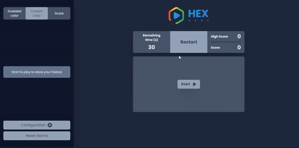

<h1 align="center" color="white"></h1>



<h2 align="center"><a color="white" href="https://www.hexgame.ga">Acess HEX Game</a></h2>

### 📕 About

**HEX Game** is a game for those want to practice your habilities with
hexadecimals colors build with React JS, Tailwind CSS and Context-API. Fully
responsive, and with the features that you can check out below.

### ⚙️ Features

-   [x] Score
-   [x] Timer
-   [x] High score save in bronwser
-   [x] Reset All Data
-   [x] Easy, Medium and Hard Levels

### Prerequisites

```bash
  #### Clone this repository
  $ git clone "https://github.com/uildez/hexGame.git"
```

```bash
  #### Install dependencies
  $ npm cd hexGame
```

```bash
  #### Install dependencies
  $ npm install
```

```bash
  #### Run the application in development mode
  $ npm run dev
```

### 🛠 Technologies

The following tools were used in building the project:

-   [React](https://pt-br.reactjs.org/)
-   [TailwindCSS](https://tailwindcss.com/docs/installation)

<h4 align="center">
🚧 HEXGame 🚀 In refinement... 🚧
</h4>
